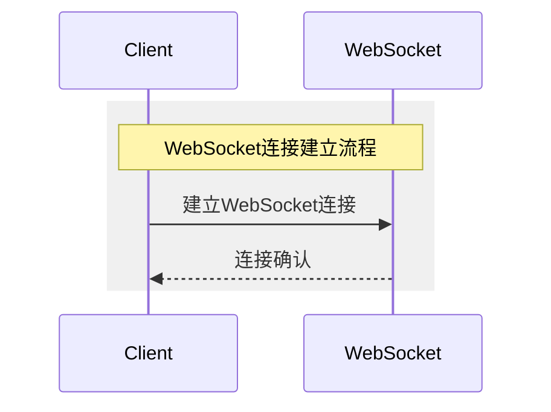
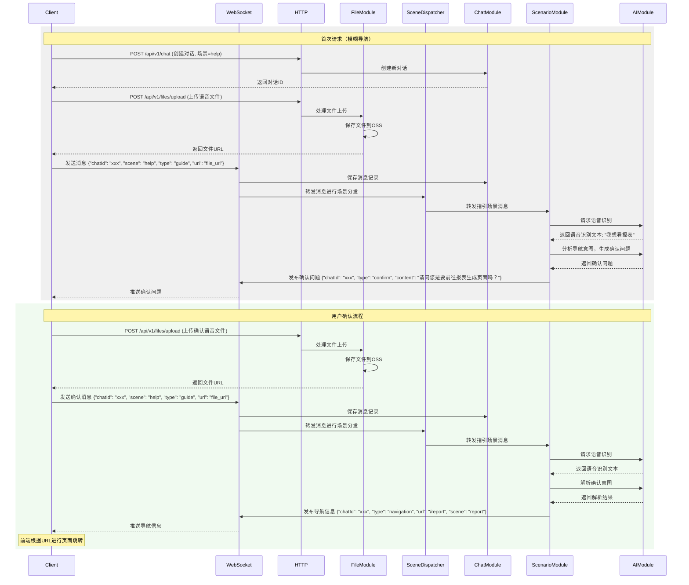
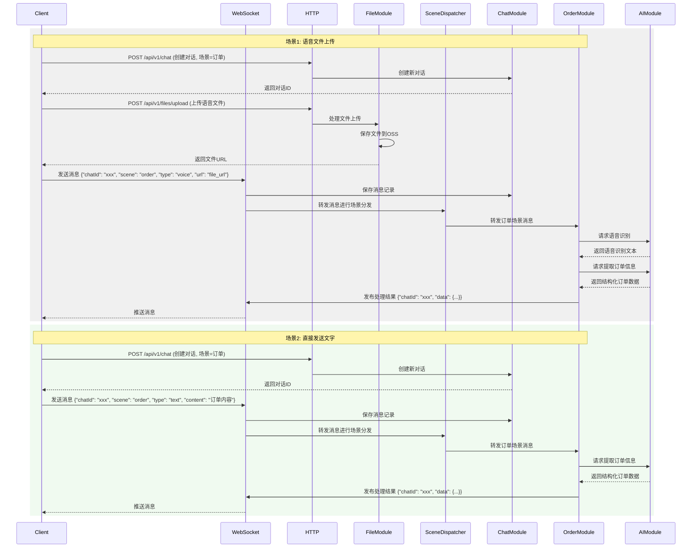
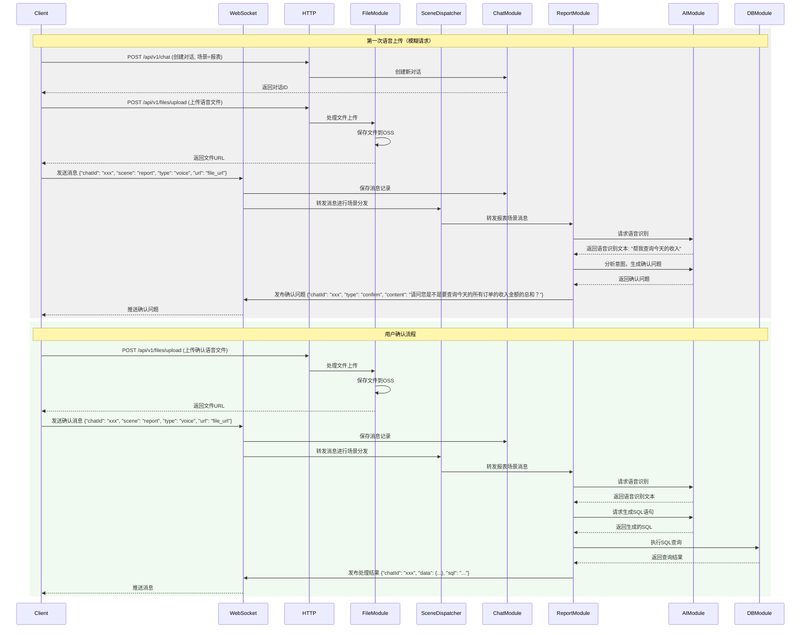
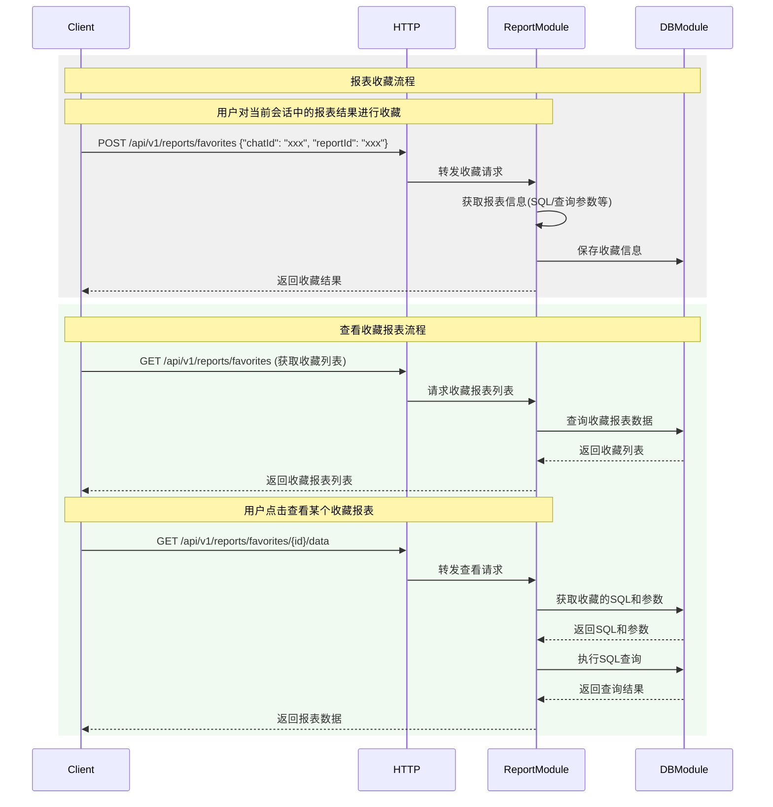

# 系统交互时序图设计

## 1.建立websocket连接

* 前端首次打开即建立WebSocket连接
* 一个WebSocket连接可以处理多个对话

## 2.指引场景

* 用户进入首页后通过语音进行功能导航
* 后台处理导航请求并返回目标URL，前端完成功能跳转

## 3.智能填单场景

* 创建订单场景的对话
* 通过语音/文字输入订单信息

## 4.智能报表场景

* 创建报表场景的对话
* 语音/文字描述报表需求
* 支持模糊请求的二次确认

## 5.报表收藏时序

