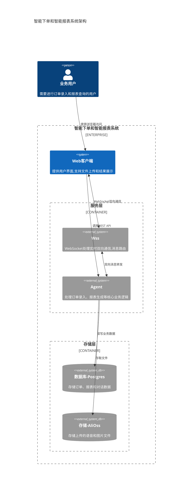

# 应用系统架构图

在系统的总体架构上，我们有两个核心服务：
* wss - websocket server
  主要负责 Websocket 通信管理，包括与客户端的 Websocket 实时通信管理以及链接状态管理

* agent - AI agent service
  主要的核心服务，负责接收用户的请求，并将其转交给 AI 大模型进行处理，通过智能地与用户交互，最终了解用户需求并返回用户所需的结果，目前结果主要是订单数据和报表数据-

