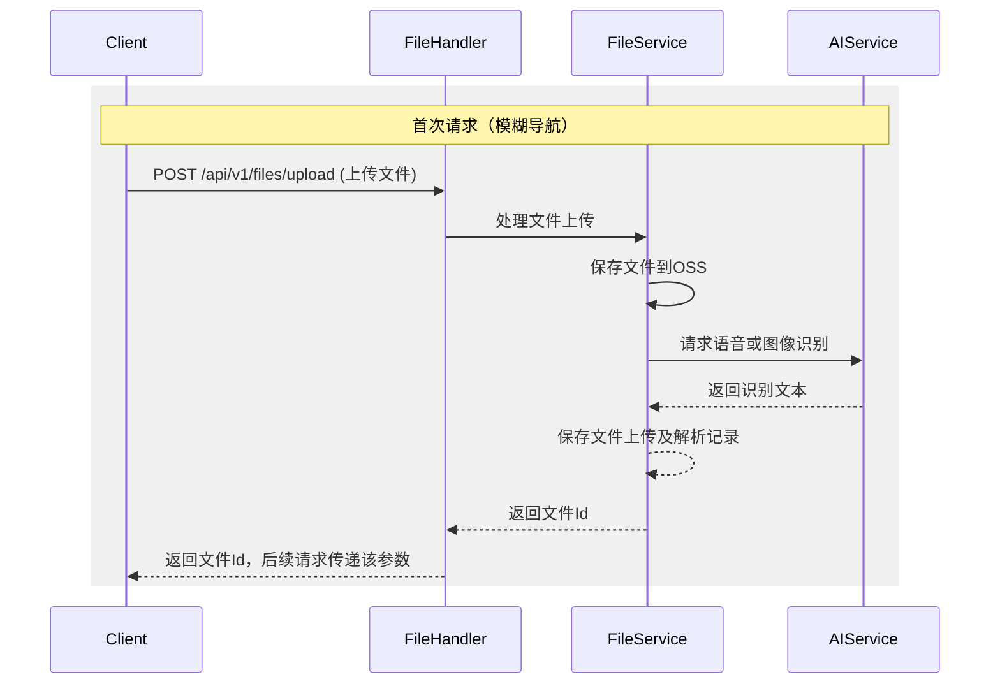
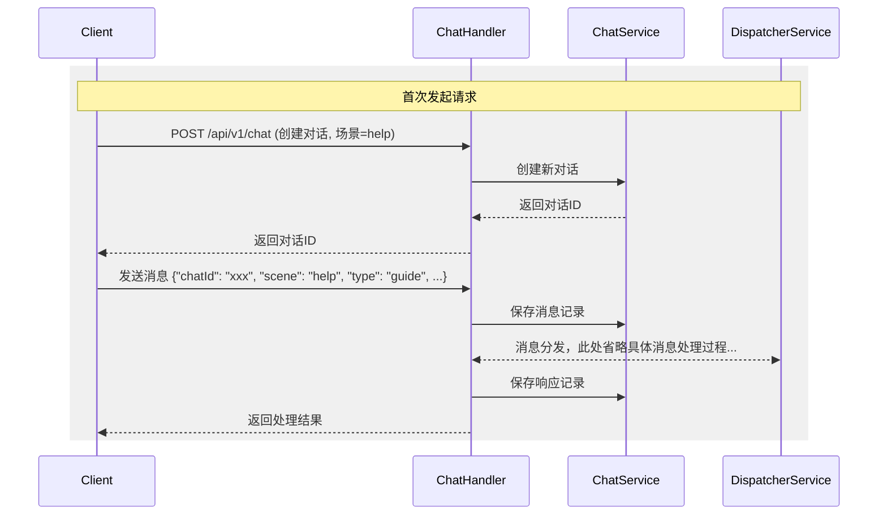
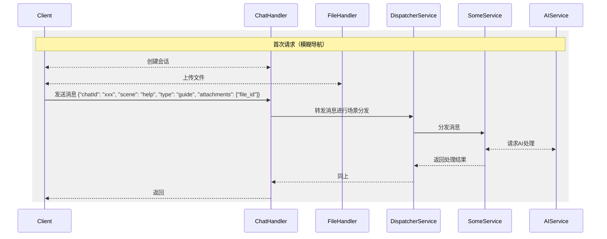
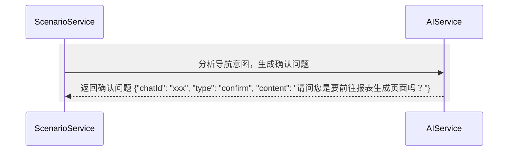
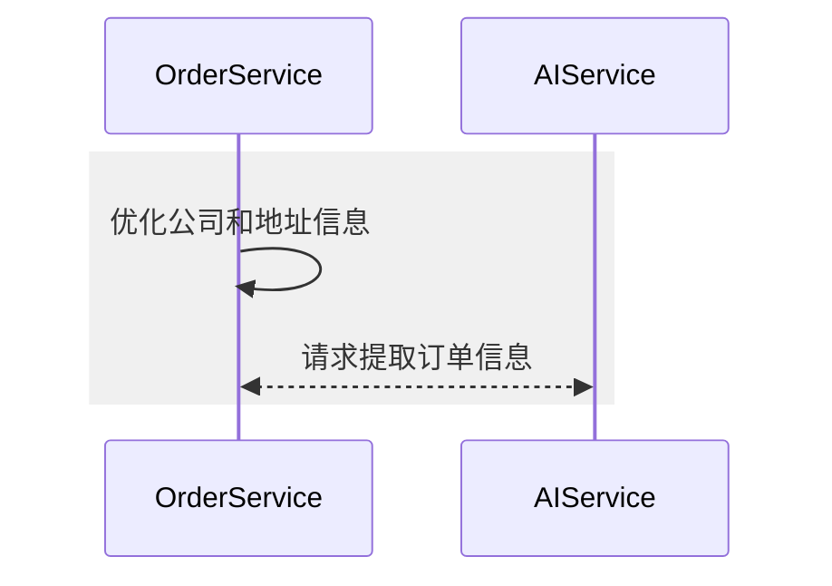
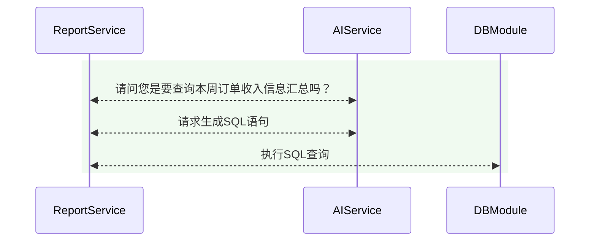
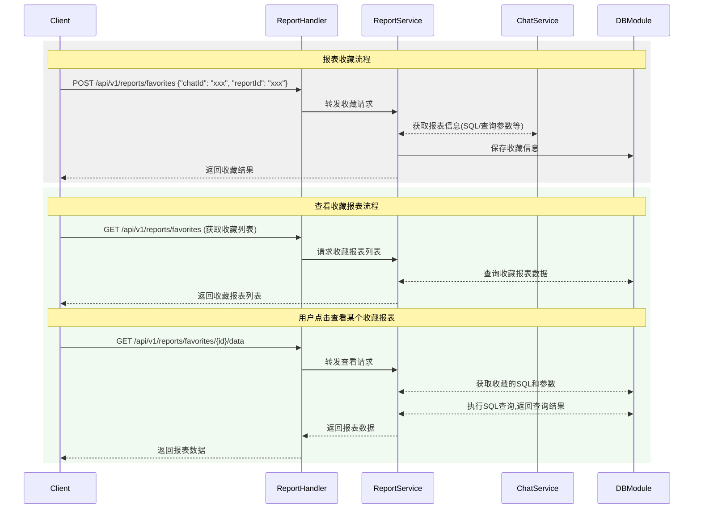

# 应用软件交互时序图

## 1.文件上传场景

发送语音，或者上传图片时，使用该流程，处理完成后返回客户端文件Id。

## 2.创建会话

创建一次对话的交互流程

## 3. 通用请求处理场景

## 4.指引场景

* 用户进入首页后通过语音进行功能导航
* 后台处理导航请求并返回目标URL，前端完成功能跳转

## 5.智能填单场景

* 创建订单场景的对话
* 通过语音/文字输入订单信息

## 6.智能报表场景

* 创建报表场景的对话
* 语音/文字描述报表需求
* 支持模糊请求的二次确认

## 7.报表收藏时序

