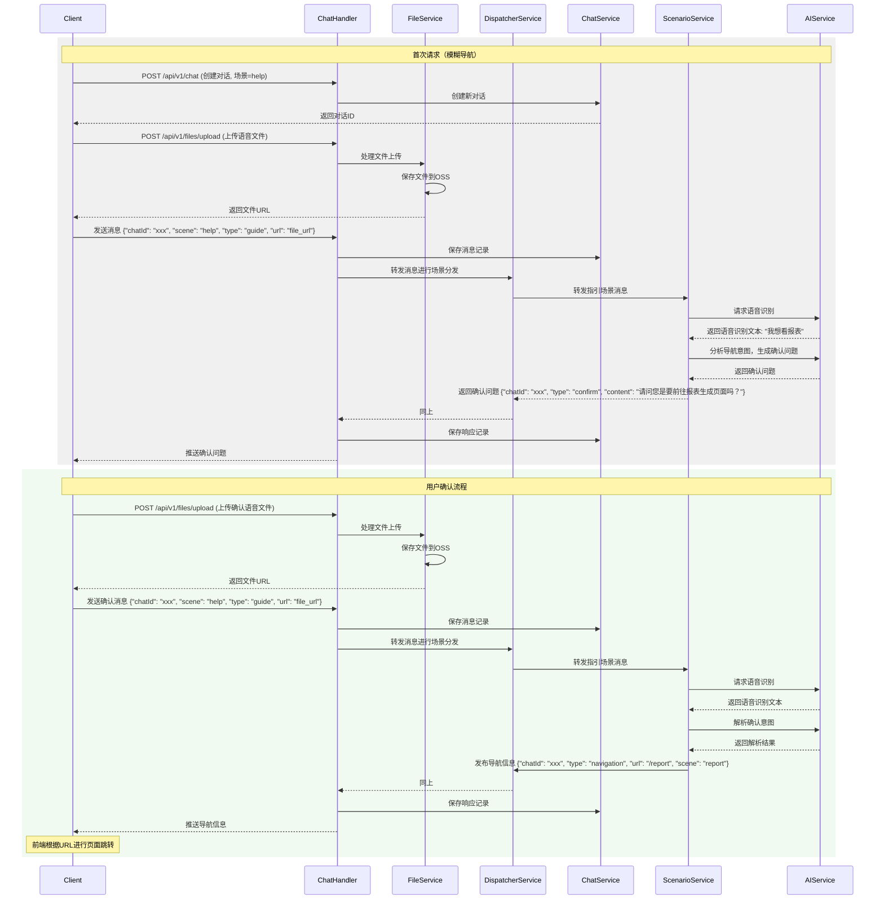
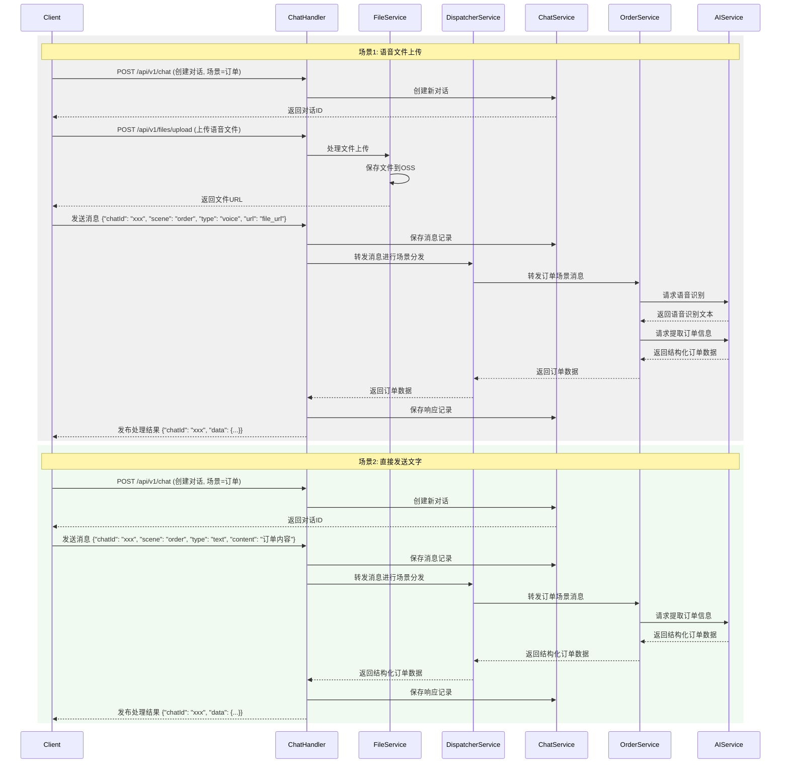
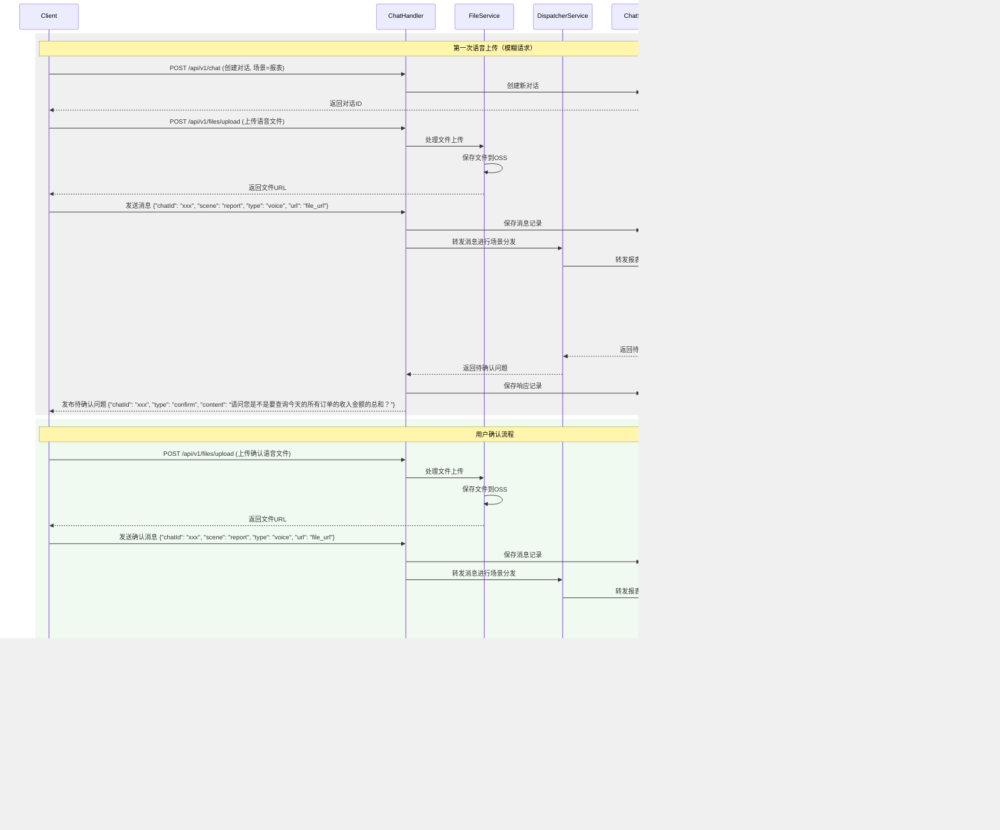
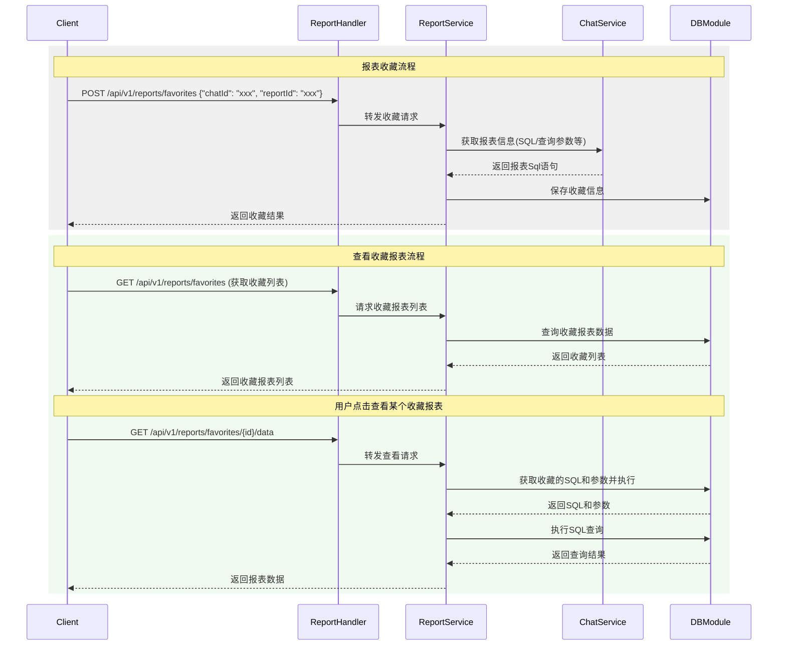

# 应用软件交互时序图

## 1.指引场景

* 用户进入首页后通过语音进行功能导航
* 后台处理导航请求并返回目标URL，前端完成功能跳转

```mermaid
sequenceDiagram
    participant Client
    participant ChatHandler
    participant FileService
    participant DispatcherService
    participant ChatService
    participant ScenarioService
    participant AIService

    %% 第一次语音文件上传流程（首页导航请求）
    rect rgb(240, 240, 240)
        Note over Client,AIService: 首次请求（模糊导航）
        Client->>ChatHandler: POST /api/v1/chat (创建对话, 场景=help)
        ChatHandler->>ChatService: 创建新对话
        ChatService-->>Client: 返回对话ID
        
        Client->>ChatHandler: POST /api/v1/files/upload (上传语音文件)
        ChatHandler->>FileService: 处理文件上传
        FileService->>FileService: 保存文件到OSS
        FileService-->>Client: 返回文件URL
        
        Client->>ChatHandler: 发送消息 {"chatId": "xxx", "scene": "help", "type": "guide", "url": "file_url"}
        ChatHandler->>ChatService: 保存消息记录
        ChatHandler->>DispatcherService: 转发消息进行场景分发
        DispatcherService->>ScenarioService: 转发指引场景消息
        ScenarioService->>AIService: 请求语音识别
        AIService-->>ScenarioService: 返回语音识别文本: "我想看报表"
        ScenarioService->>AIService: 分析导航意图，生成确认问题
        AIService-->>ScenarioService: 返回确认问题
        ScenarioService-->>DispatcherService: 返回确认问题 {"chatId": "xxx", "type": "confirm", "content": "请问您是要前往报表生成页面吗？"}
        DispatcherService-->>ChatHandler: 同上
        ChatHandler->>ChatService: 保存响应记录
        ChatHandler-->>Client: 推送确认问题
    end

    %% 用户确认流程
    rect rgb(240, 250, 240)
        Note over Client,AIService: 用户确认流程
        Client->>ChatHandler: POST /api/v1/files/upload (上传确认语音文件)
        ChatHandler->>FileService: 处理文件上传
        FileService->>FileService: 保存文件到OSS
        FileService-->>Client: 返回文件URL
        
        Client->>ChatHandler: 发送确认消息 {"chatId": "xxx", "scene": "help", "type": "guide", "url": "file_url"}
        ChatHandler->>ChatService: 保存消息记录
        ChatHandler->>DispatcherService: 转发消息进行场景分发
        DispatcherService->>ScenarioService: 转发指引场景消息
        ScenarioService->>AIService: 请求语音识别
        AIService-->>ScenarioService: 返回语音识别文本
        ScenarioService->>AIService: 解析确认意图
        AIService-->>ScenarioService: 返回解析结果
        ScenarioService->>DispatcherService: 发布导航信息 {"chatId": "xxx", "type": "navigation", "url": "/report", "scene": "report"}
        DispatcherService-->>ChatHandler: 同上
        ChatHandler->>ChatService: 保存响应记录
        ChatHandler-->>Client: 推送导航信息
        Note over Client: 前端根据URL进行页面跳转
    end
```

## 2.智能填单场景

* 创建订单场景的对话
* 通过语音/文字输入订单信息

```mermaid
sequenceDiagram
    participant Client
    participant ChatHandler
    participant FileService
    participant DispatcherService
    participant ChatService
    participant OrderService
    participant AIService

    %% %% WebSocket连接建立（只需要建立一次）
    %% Client->>ChatHandler: 建立WebSocket连接
    %% ChatHandler-->>Client: 连接确认

    %% 场景1: 语音文件上传流程
    rect rgb(240, 240, 240)
        Note over Client,AIService: 场景1: 语音文件上传
        Client->>ChatHandler: POST /api/v1/chat (创建对话, 场景=订单)
        ChatHandler->>ChatService: 创建新对话
        ChatService-->>Client: 返回对话ID
        
        Client->>ChatHandler: POST /api/v1/files/upload (上传语音文件)
        ChatHandler->>FileService: 处理文件上传
        FileService->>FileService: 保存文件到OSS
        FileService-->>Client: 返回文件URL
        
        Client->>ChatHandler: 发送消息 {"chatId": "xxx", "scene": "order", "type": "voice", "url": "file_url"}
        ChatHandler->>ChatService: 保存消息记录
        ChatHandler->>DispatcherService: 转发消息进行场景分发
        DispatcherService->>OrderService: 转发订单场景消息
        OrderService->>AIService: 请求语音识别
        AIService-->>OrderService: 返回语音识别文本
        OrderService->>AIService: 请求提取订单信息
        AIService-->>OrderService: 返回结构化订单数据
        OrderService-->>DispatcherService: 返回订单数据
        DispatcherService-->>ChatHandler: 返回订单数据
        ChatHandler->>ChatService: 保存响应记录
        ChatHandler-->>Client: 发布处理结果 {"chatId": "xxx", "data": {...}}
    end

    %% 场景2: 直接发送文字流程
    rect rgb(240, 250, 240)
        Note over Client,AIService: 场景2: 直接发送文字
        Client->>ChatHandler: POST /api/v1/chat (创建对话, 场景=订单)
        ChatHandler->>ChatService: 创建新对话
        ChatService-->>Client: 返回对话ID
        
        Client->>ChatHandler: 发送消息 {"chatId": "xxx", "scene": "order", "type": "text", "content": "订单内容"}
        ChatHandler->>ChatService: 保存消息记录
        ChatHandler->>DispatcherService: 转发消息进行场景分发
        DispatcherService->>OrderService: 转发订单场景消息
        OrderService->>AIService: 请求提取订单信息
        AIService-->>OrderService: 返回结构化订单数据
        OrderService-->>DispatcherService: 返回结构化订单数据
        DispatcherService-->>ChatHandler: 返回结构化订单数据
        ChatHandler->>ChatService: 保存响应记录
        ChatHandler-->>Client: 发布处理结果 {"chatId": "xxx", "data": {...}}
    end
```

## 3.智能报表场景

* 创建报表场景的对话
* 语音/文字描述报表需求
* 支持模糊请求的二次确认

```mermaid
sequenceDiagram
    participant Client
    participant ChatHandler
    participant FileService
    participant DispatcherService
    participant ChatService
    participant ReportService
    participant AIService
    participant DBModule

    %% %% WebSocket连接建立（只需要建立一次）
    %% Client->>ChatHandler: 建立WebSocket连接
    %% ChatHandler-->>Client: 连接确认

    %% 第一次语音文件上传流程（模糊请求）
    rect rgb(240, 240, 240)
        Note over Client,DBModule: 第一次语音上传（模糊请求）
        Client->>ChatHandler: POST /api/v1/chat (创建对话, 场景=报表)
        ChatHandler->>ChatService: 创建新对话
        ChatService-->>Client: 返回对话ID
        
        Client->>ChatHandler: POST /api/v1/files/upload (上传语音文件)
        ChatHandler->>FileService: 处理文件上传
        FileService->>FileService: 保存文件到OSS
        FileService-->>Client: 返回文件URL
        
        Client->>ChatHandler: 发送消息 {"chatId": "xxx", "scene": "report", "type": "voice", "url": "file_url"}

        ChatHandler->>ChatService: 保存消息记录
        ChatHandler->>DispatcherService: 转发消息进行场景分发
        DispatcherService->>ReportService: 转发报表场景消息
        ReportService->>AIService: 请求语音识别
        AIService-->>ReportService: 返回语音识别文本: "帮我查询今天的收入"
        ReportService->>AIService: 分析意图，生成确认问题
        AIService-->>ReportService: 返回确认问题
        ReportService-->>DispatcherService: 返回待确认问题
        DispatcherService-->>ChatHandler: 返回待确认问题
        ChatHandler->>ChatService: 保存响应记录
        ChatHandler-->>Client: 发布待确认问题 {"chatId": "xxx", "type": "confirm", "content": "请问您是不是要查询今天的所有订单的收入金额的总和？"}
    end

    %% 用户确认流程
    rect rgb(240, 250, 240)
        Note over Client,DBModule: 用户确认流程
        Client->>ChatHandler: POST /api/v1/files/upload (上传确认语音文件)
        ChatHandler->>FileService: 处理文件上传
        FileService->>FileService: 保存文件到OSS
        FileService-->>Client: 返回文件URL
        
        Client->>ChatHandler: 发送确认消息 {"chatId": "xxx", "scene": "report", "type": "voice", "url": "file_url"}
        ChatHandler->>ChatService: 保存消息记录
        ChatHandler->>DispatcherService: 转发消息进行场景分发
        DispatcherService->>ReportService: 转发报表场景消息
        ReportService->>AIService: 请求语音识别
        AIService-->>ReportService: 返回语音识别文本
        ReportService->>AIService: 请求生成SQL语句
        AIService-->>ReportService: 返回生成的SQL
        ReportService->>DBModule: 执行SQL查询
        DBModule-->>ReportService: 返回查询结果
        ReportService-->>DispatcherService: 返回查询结果
        DispatcherService-->>ChatHandler: 返回查询结果
        ChatHandler->>ChatService: 保存响应记录
        ChatHandler-->>Client: 发布处理结果 {"chatId": "xxx", "data": {...}, "sql": "..."}
    end
```

## 4.报表收藏时序

```mermaid
sequenceDiagram
    participant Client
    participant ReportHandler
    participant ReportService
    participant ChatService 
    participant DBModule

    rect rgb(240, 240, 240)
        Note over Client,DBModule: 报表收藏流程
        
        Client->>ReportHandler: POST /api/v1/reports/favorites {"chatId": "xxx", "reportId": "xxx"}
        ReportHandler->>ReportService: 转发收藏请求
        ReportService->>ChatService: 获取报表信息(SQL/查询参数等)
        ChatService-->>ReportService: 返回报表Sql语句
        ReportService->>DBModule: 保存收藏信息
        ReportService-->>Client: 返回收藏结果
    end

    rect rgb(240, 250, 240)
        Note over Client,DBModule: 查看收藏报表流程
        
        Client->>ReportHandler: GET /api/v1/reports/favorites (获取收藏列表)
        ReportHandler->>ReportService: 请求收藏报表列表
        ReportService->>DBModule: 查询收藏报表数据
        DBModule-->>ReportService: 返回收藏列表
        ReportService-->>Client: 返回收藏报表列表
        
        Note over Client,DBModule: 用户点击查看某个收藏报表
        Client->>ReportHandler: GET /api/v1/reports/favorites/{id}/data
        ReportHandler->>ReportService: 转发查看请求
        ReportService->>DBModule: 获取收藏的SQL和参数并执行
        DBModule-->>ReportService: 返回SQL和参数
        ReportService->>DBModule: 执行SQL查询
        DBModule-->>ReportService: 返回查询结果
        ReportService-->>Client: 返回报表数据
    end
```