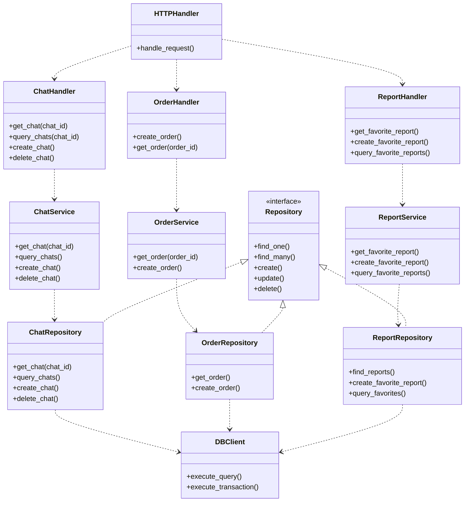

# 应用软件分层架构E-R图

```mermaid
classDiagram
    class HTTPHandler {
        +handle_request()
    }
    
    class ChatHandler {
        +get_chat(chat_id)
        +query_chats(chat_id)
        +create_chat()
        +delete_chat()
    }
    
    class OrderHandler {
        +create_order()
        +get_order(order_id)
    }
    
    class ReportHandler {
        +get_favorite_report()
        +create_favorite_report()
        +query_favorite_reports()
    }

    class ChatService {
        +get_chat(chat_id)
        +query_chats()
        +create_chat()
        +delete_chat()
    }

    class OrderService {
        +get_order(order_id)
        +create_order()
    }

    class ReportService {
        +get_favorite_report()
        +create_favorite_report()
        +query_favorite_reports()
    }

    class DBClient {
        +execute_query()
        +execute_transaction()
    }

    class Repository {
        <<interface>>
        +find_one()
        +find_many()
        +create()
        +update()
        +delete()
    }

    class ChatRepository {
        +get_chat(chat_id)
        +query_chats()
        +create_chat()
        +delete_chat()
    }

    class OrderRepository {
        +get_order()
        +create_order()
    }

    class ReportRepository {
        +find_reports()
        +create_favorite_report()
        +query_favorites()
    }

    HTTPHandler ..> ChatHandler
    HTTPHandler ..> OrderHandler
    HTTPHandler ..> ReportHandler
    
    ChatHandler ..> ChatService
    OrderHandler ..> OrderService
    ReportHandler ..> ReportService
    
    ChatService ..> ChatRepository
    OrderService ..> OrderRepository
    ReportService ..> ReportRepository
    
    Repository <|.. ChatRepository
    Repository <|.. OrderRepository
    Repository <|.. ReportRepository
    
    ChatRepository ..> DBClient
    OrderRepository ..> DBClient
    ReportRepository ..> DBClient
```
