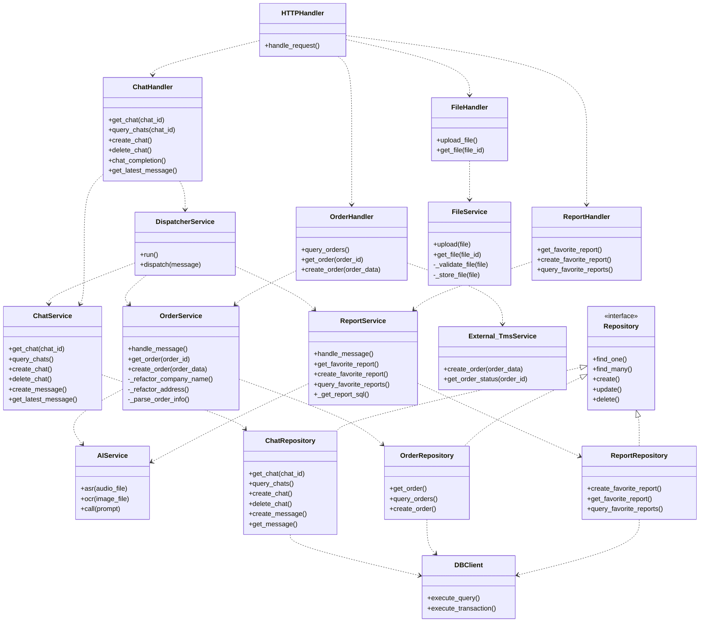

# 应用软件分层架构E-R图




暂时不用 `Websocket`，以下内容暂不启动:

```
class External_WssService {
    +on_connect()
    +on_message()
    +on_disconnect()
}

class WebSocketHandler {
    +publish(topic, message)
    +subscribe(topic, callback)
    +unsubscribe(topic)
    +keep_alive()
    +get_topics()
    +get_connections()
}
```