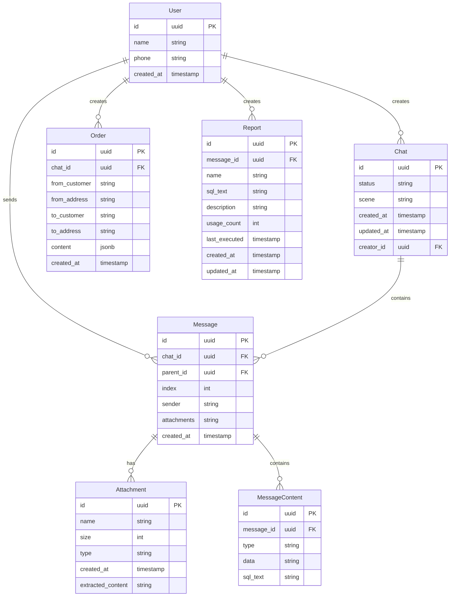

# 逻辑模型E-R图

* 用户信息从 TMS 系统同步过来
* order 信息在 content 中通过 JSON 的形式记录订单全部信息。 
* report 表格记录的是用户收藏的报表信息。 * message 所关联的 MessageContent 在实际实现时可在 message 表中增加一个 JSONB 的 content 字段
* attachment 用来保存用户上传的图片或者语音以及系统所生成的 SVG 图片等。