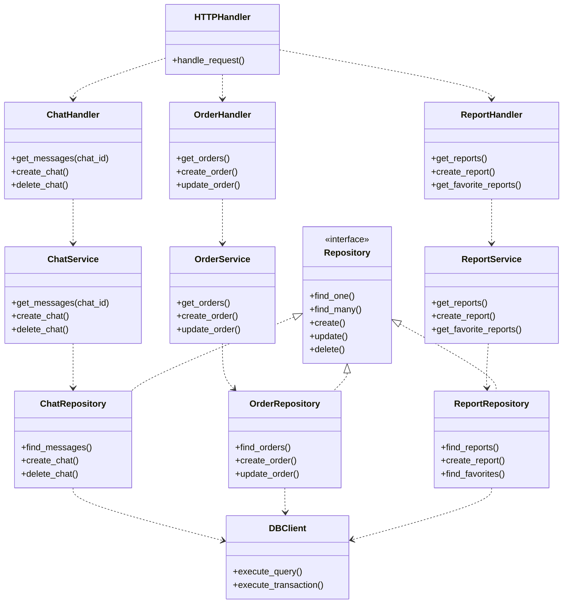

# 应用架构设计规范

## 应用架构分层原则

1. **分层职责**：
   - Handler层：处理HTTP请求/响应，参数验证，路由。Handler 层来协调不同服务之间的交互，Handler 处理跨服务的调用和数据转换
   - Service层：处理业务逻辑，事务管理，领域规则。Service 层只处理单一领域的业务逻辑,不包含其他服务的集成逻辑。
   - Repository层：处理数据访问，SQL执行，数据映射

2. **依赖注入**：
   - 上层通过构造函数注入依赖。所有依赖都通过构造函数注入，便于测试和维护
   - 避免模块间的直接耦合
   - 便于单元测试和模块替换

3. **接口隔离**：
   - Repository层实现统一的接口
   - Service层不直接依赖具体的数据库实现
   - 便于切换数据源或添加缓存层

4. **单向依赖**：
   - HTTP模块依赖业务模块
   - 业务模块不知道HTTP模块的存在
   - 避免循环依赖

这种设计的优点：

1. **模块解耦**：
   - 每个模块只依赖其直接的下层
   - 便于独立开发和测试
   - 便于替换具体实现

2. **代码复用**：
   - Repository层可以被多个Service复用
   - 数据库连接和事务管理统一处理

3. **可测试性**：
   - 每层都可以独立测试
   - 可以轻松Mock依赖
   - 便于编写单元测试

4. **可维护性**：
   - 职责清晰，代码结构明确
   - 容易定位和修复问题
   - 便于新功能扩展

建议：
1. 使用依赖注入容器管理对象创建和生命周期
2. 为核心接口编写抽象基类
3. 使用异步框架(如FastAPI)处理HTTP请求
4. 实现统一的错误处理和日志记录

## `应用软件分层架构E-R图` 示例

我们以智能下单和智能报表的场景为例，请参考如下模块之间的关系ER图理解 应用架构中的分层设计和依赖关系管理：

