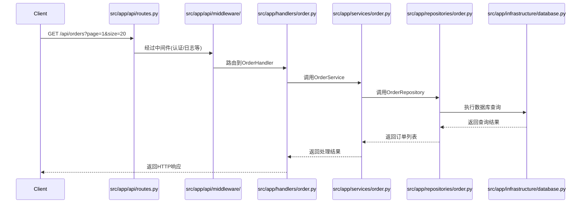

# 技术架构设计规范

## 技术规范

* 系统使用 Python 语言实现。
* 通过 makefile 等方式将系统编译为 Cpython 可执行文件以保护代码。
* 最终文件打包成二进制镜像，以 Docker 形式部署。
* 使用 postgres 数据库。
* 对所有 API 在请求层进行拦截，打印所有请求的输入和输出。

## 通用技术模块 - 所有应用软件都包含
* 配置管理模块
  * 核心职责：
    - YAML 配置文件加载与解析
    - 环境变量配置加载
    - 配置优先级管理
  * 配置加载规则：
    - 环境变量配置覆盖YAML配置
    - 环境变量命名规则：
      ```
      # YAML配置示例：
      database:
        host: localhost
        port: 5432
        
      # 对应的环境变量：
      DATABASE_HOST=xxx
      DATABASE_PORT=xxx
      ```
* 日志管理模块
  * 核心职责：
    - 日志分级管理（DEBUG/INFO/WARN/ERROR）
    - 日志格式化输出
    - 日志文件管理
  * 日志规范：
    - 统一的日志格式：
      ```
      [时间戳] [日志级别] [模块名] 日志内容
      ```
    - 日志文件切割与归档

* 支持swagger

## 2.`应用软件模块代码调用时序图`示例

针对每个 API 设计应用软件模块代码调用时序图，当客户端发起 API 调用时，从代码视角展示，呈现此次 API 调用引发的应用软件内部各模块代码文件之间的调用关系。



## 3.`分层设计依赖注入代码`示例

1. 分层设计：
```python
# 1. Handler层 (src/app/http/handlers/)
class OrderHandler:
    def __init__(self, order_service: OrderService):
        self._service = order_service
    
    async def get_orders(self, request):
        # 处理HTTP请求参数
        params = request.query_params
        # 调用服务层方法
        orders = await self._service.get_orders(params)
        # 返回HTTP响应
        return JSONResponse(orders)

# 2. Service层 (src/app/order/service.py)
class OrderService:
    def __init__(self, repository: OrderRepository):
        self._repository = repository
    
    async def get_orders(self, params):
        # 处理业务逻辑
        orders = await self._repository.find_many(params)
        return orders

# 3. Repository层 (src/app/db/repositories/order.py)
class OrderRepository:
    def __init__(self, db_client: DBClient):
        self._db = db_client
    
    async def find_many(self, params):
        query = "SELECT * FROM orders WHERE..."
        return await self._db.execute_query(query, params)

# 4. 依赖注入配置 (src/app/main.py)
def setup_dependencies(app):
    # 数据库客户端
    db_client = DBClient(config.DATABASE_URL)
    
    # Repositories
    order_repo = OrderRepository(db_client)
    chat_repo = ChatRepository(db_client)
    report_repo = ReportRepository(db_client)
    
    # Services
    order_service = OrderService(order_repo)
    chat_service = ChatService(chat_repo)
    report_service = ReportService(report_repo)
    
    # Handlers
    app.add_handler("/orders", OrderHandler(order_service))
    app.add_handler("/chats", ChatHandler(chat_service))
    app.add_handler("/reports", ReportHandler(report_service))
```

