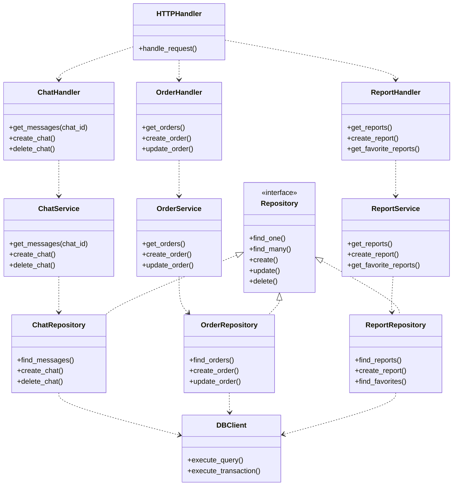
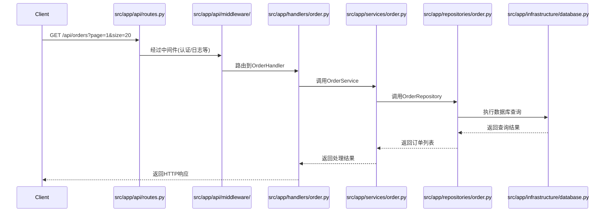

# 技术架构设计规范

## 1.分层设计的ER图

应用架构中的分层设计和依赖关系管理，模块之间的关系ER图：



## 2.api调用流程



## 3.具体的架构的设计和实现方案

1. 分层设计：
```python
# 1. Handler层 (src/app/http/handlers/)
class OrderHandler:
    def __init__(self, order_service: OrderService):
        self._service = order_service
    
    async def get_orders(self, request):
        # 处理HTTP请求参数
        params = request.query_params
        # 调用服务层方法
        orders = await self._service.get_orders(params)
        # 返回HTTP响应
        return JSONResponse(orders)

# 2. Service层 (src/app/order/service.py)
class OrderService:
    def __init__(self, repository: OrderRepository):
        self._repository = repository
    
    async def get_orders(self, params):
        # 处理业务逻辑
        orders = await self._repository.find_many(params)
        return orders

# 3. Repository层 (src/app/db/repositories/order.py)
class OrderRepository:
    def __init__(self, db_client: DBClient):
        self._db = db_client
    
    async def find_many(self, params):
        query = "SELECT * FROM orders WHERE..."
        return await self._db.execute_query(query, params)

# 4. 依赖注入配置 (src/app/main.py)
def setup_dependencies(app):
    # 数据库客户端
    db_client = DBClient(config.DATABASE_URL)
    
    # Repositories
    order_repo = OrderRepository(db_client)
    chat_repo = ChatRepository(db_client)
    report_repo = ReportRepository(db_client)
    
    # Services
    order_service = OrderService(order_repo)
    chat_service = ChatService(chat_repo)
    report_service = ReportService(report_repo)
    
    # Handlers
    app.add_handler("/orders", OrderHandler(order_service))
    app.add_handler("/chats", ChatHandler(chat_service))
    app.add_handler("/reports", ReportHandler(report_service))
```

主要设计原则：

1. **分层职责**：
   - Handler层：处理HTTP请求/响应，参数验证，路由
   - Service层：处理业务逻辑，事务管理，领域规则
   - Repository层：处理数据访问，SQL执行，数据映射

2. **依赖注入**：
   - 上层通过构造函数注入依赖
   - 避免模块间的直接耦合
   - 便于单元测试和模块替换

3. **接口隔离**：
   - Repository层实现统一的接口
   - Service层不直接依赖具体的数据库实现
   - 便于切换数据源或添加缓存层

4. **单向依赖**：
   - HTTP模块依赖业务模块
   - 业务模块不知道HTTP模块的存在
   - 避免循环依赖

这种设计的优点：

1. **模块解耦**：
   - 每个模块只依赖其直接的下层
   - 便于独立开发和测试
   - 便于替换具体实现

2. **代码复用**：
   - Repository层可以被多个Service复用
   - 数据库连接和事务管理统一处理

3. **可测试性**：
   - 每层都可以独立测试
   - 可以轻松Mock依赖
   - 便于编写单元测试

4. **可维护性**：
   - 职责清晰，代码结构明确
   - 容易定位和修复问题
   - 便于新功能扩展

建议：
1. 使用依赖注入容器管理对象创建和生命周期
2. 为核心接口编写抽象基类
3. 使用异步框架(如FastAPI)处理HTTP请求
4. 实现统一的错误处理和日志记录
